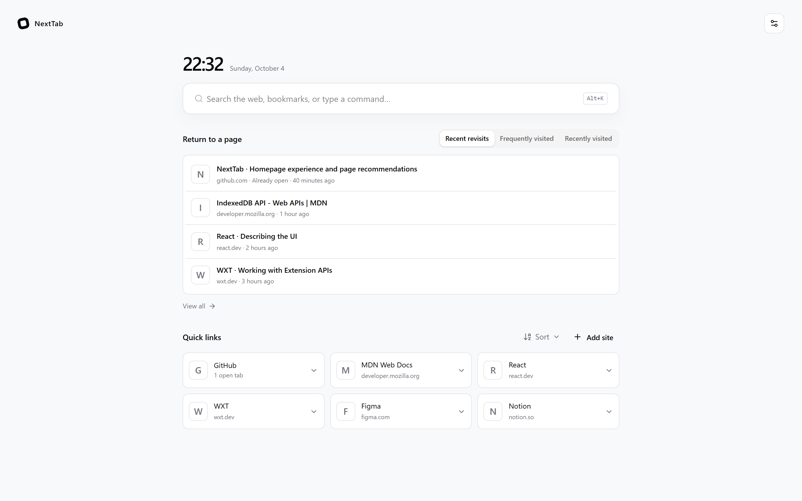
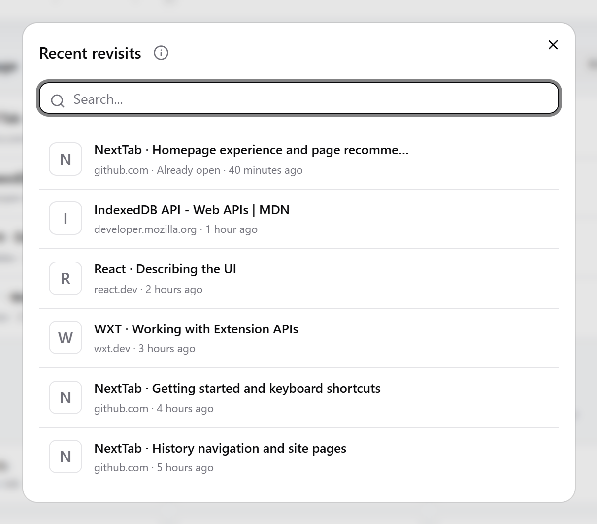
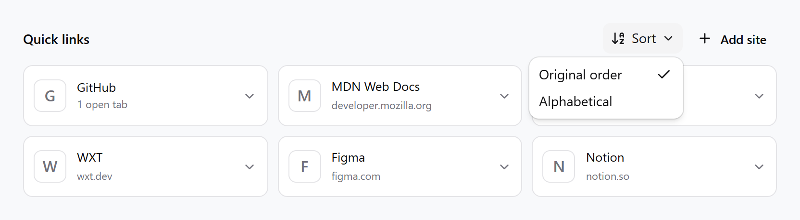
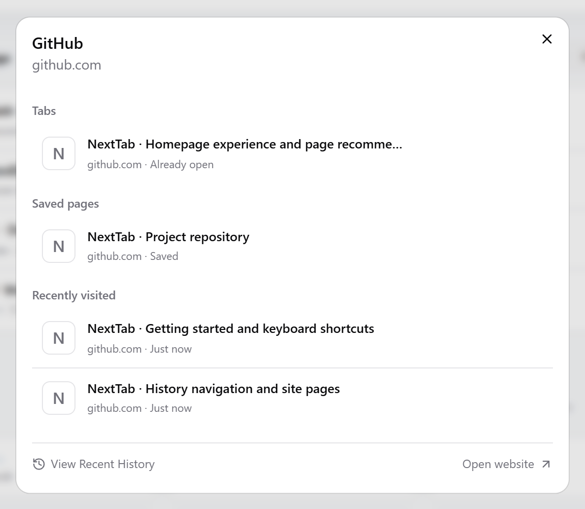
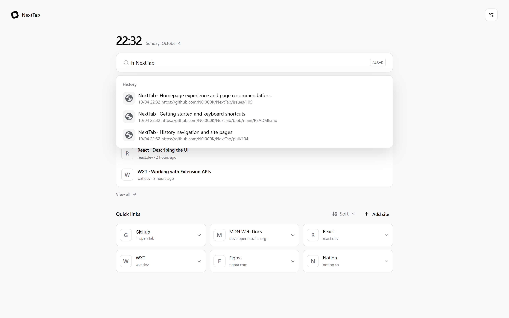
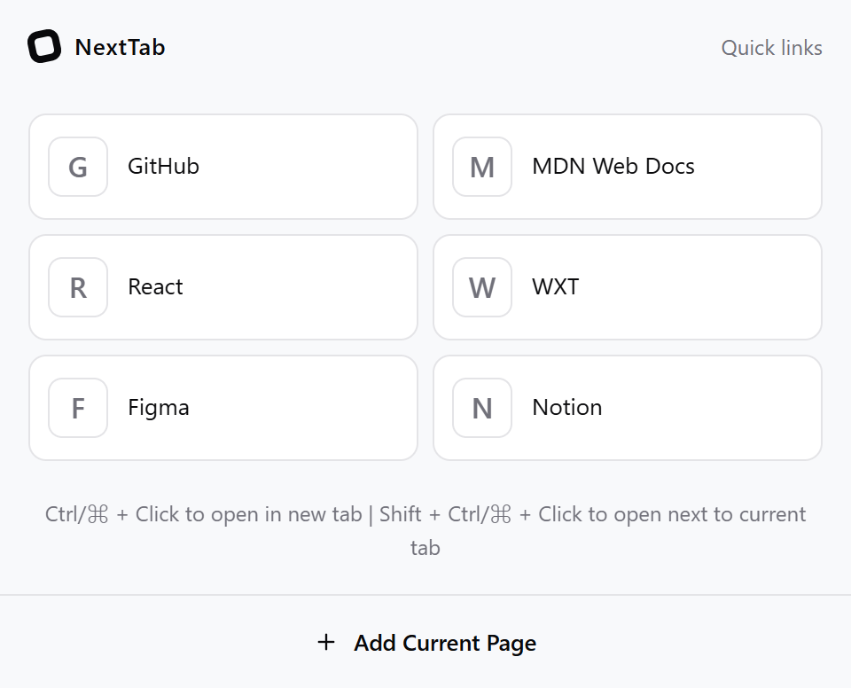

<div align="center">

<h1>NextTab</h1>
<p>An efficiency-focused browser start page, clean and modern</p>

[](https://react.dev/)
[](https://www.typescriptlang.org/)
[](https://wxt.dev/)
[](https://github.com/N0I0C0K/NextTab/blob/master/LICENSE)
[](https://github.com/N0I0C0K/NextTab/releases)

English | [简体中文](README.md)

</div>

---

## 📖 Table of Contents

- [Introduction](#introduction)
- [Key Features](#-key-features)
- [Feature Showcase](#-feature-showcase)
  - [Return to a Page](#return-to-a-page)
  - [Quick Links](#quick-links)
  - [Command Palette](#command-palette)
  - [Popup Interface](#popup-interface)
  - [Themes and Data Management](#themes-and-data-management)
- [Installation](#installation)
- [Development](#development)
- [Browser Support](#browser-support)
- [License](#license)

## Introduction

NextTab is a new tab page extension focused on boosting browser efficiency with a clean and modern design. Keep pages you may want to revisit, frequently used websites, and search in one place. Pick up where you left off faster, and focus on what truly matters.



## ✨ Key Features

- 🕘 **Return to a Page** - Find pages you may want to revisit using local usage records, or browse frequently and recently visited pages
- 🔗 **Efficient Quick Links** - Fast access to frequently used websites with drag-and-drop and alphabetical sorting. Expand a site to view related pages
- ⚡ **Powerful Command Palette** - Search tabs, bookmarks, and history, with web search, a calculator, and uppercase RMB conversion
- 🎨 **Clean Light and Dark Themes** - Choose light, dark, or system appearance for a clear and comfortable page
- ⌨️ **Keyboard First** - Comprehensive keyboard shortcut support for efficient operation
- 📱 **Responsive Design** - Adapts to various screen sizes for a consistent experience
- 🔒 **Privacy Focused** - Core features run locally. Page usage records and recommendation preferences stay in your browser, with no user data collection
- 💾 **Data Backups** - Export and import quick links and settings for backups or migration
- 🌐 **Cross-Device Sync** - Sync data across multiple devices via MQTT protocol (optional & WIP)

## 📸 Feature Showcase

### Return to a Page

Open a new tab to quickly return to content you were browsing:

- **Recent revisits** - Find pages you may want to continue browsing based on the last 7 days of page usage
- **Frequently visited** - View pages visited in the last 30 days, sorted by the number of days visited
- **Recently visited** - View pages in reverse order of their latest entry time in local activity records

Click a page to open it or return to a matching tab. If multiple matching tabs are open, you can choose which one to return to. Select **View all** to expand the full list and search by title or URL:



The page menu includes details and link copying. In recommendation lists, you can also hide a page or stop recommending a website, with an option to undo.

### Quick Links

Access frequently used websites with one click, easily reorder by dragging, or switch to alphabetical sorting. Choose **Original order** to restore your previous arrangement:



#### Expand Site Pages

Click the expand button on a quick link to view the site's open tabs, saved pages, and recent visits in one place. Find your browsing progress without searching across windows and bookmarks:



Select **View Recent History** at the bottom to search more of the site's visit history.

#### Smart Context Menu

Right-click on a quick link to edit or delete it, view recent history, or quickly access recommended pages, related bookmarks, and open tabs.

### Command Palette

Click the homepage search box, or press `Alt + K` (Windows) / `⌘ + K` (macOS) to focus the command palette for quick search and actions:



Type a keyword to search open tabs, bookmarks, and history, or use a default command to narrow the search:

| Example       | Action                                                  |
| ------------- | ------------------------------------------------------- |
| `h NextTab`   | Search history                                          |
| `b NextTab`   | Search bookmarks                                        |
| `g NextTab`   | Search the web with the browser's default search engine |
| `= 12 * 8`    | Calculate an expression; select the result to copy it   |
| `rmb 1234.56` | Convert an amount to uppercase RMB notation             |

An empty input shows available commands. In settings, you can enable or disable commands, change their trigger keys, and choose whether they appear in global search.

### Popup Interface



- Quickly access quick links without going to the New Tab page
- One-click to add the current page to quick links
- Shares quick links and sorting settings with the new tab page

### Themes and Data Management

- **Light and dark themes** - Choose light, dark, or system appearance in settings
- **Homepage settings** - Configure Return to a Page, related bookmarks, open tabs, and search box focus behavior
- **Data backups** - Export or import a JSON file to back up quick links and settings
- **Multiple languages** - Interfaces available in Simplified Chinese, Traditional Chinese, English, and German

## Installation

### Install from Store

[Chrome Web Store](https://chromewebstore.google.com/detail/nbeegkbcmmchnnncomjhhmljncmcclfd?utm_source=item-share-cb)

<!-- - [Firefox Add-ons](#) -->

### Manual Installation (Development Build)

Please refer to the [Development Guide](DEVELOPMENT.en.md#setup) for instructions on building and installing from source.

## Development

If you want to contribute to development or customize the extension, please see the [Development Guide](DEVELOPMENT.en.md).

The development guide includes:

- Requirements and setup
- Project structure
- Common development commands
- Local storage
- Builds, tests, and releases

### Quick Start

Requires Node.js 20.19+ and pnpm 9.9.

```bash
# Clone the project
git clone https://github.com/N0I0C0K/NextTab.git
cd NextTab

# Install dependencies
pnpm install

# Start development mode
pnpm dev
```

For more details, please refer to [DEVELOPMENT.en.md](DEVELOPMENT.en.md).

## Browser Support

- ✅ Chrome/Edge (Recommended)
- ✅ Firefox
- ⚠️ Other Chromium-based browsers (Untested)

## License

This project is licensed under the [MIT License](LICENSE).

---

<div align="center">

**If you find this helpful, please give it a ⭐️ Star!**

Made with ❤️ by [N0I0C0K](https://github.com/N0I0C0K). Powered by [WXT](https://wxt.dev/)

</div>
