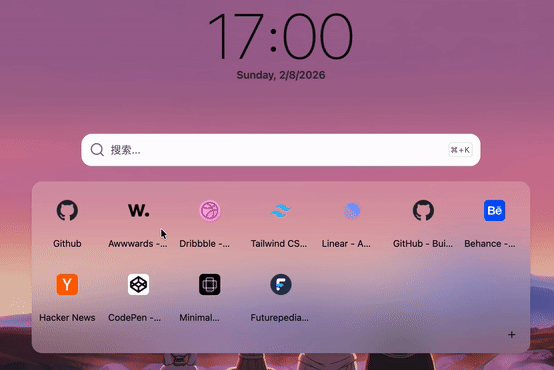
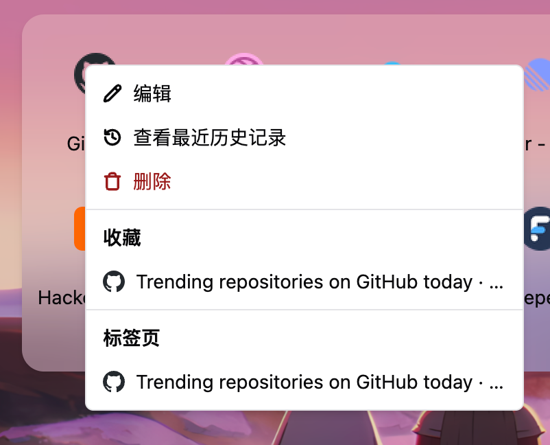
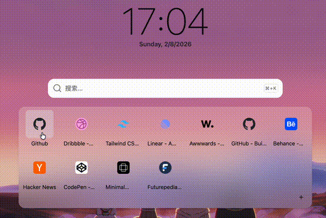
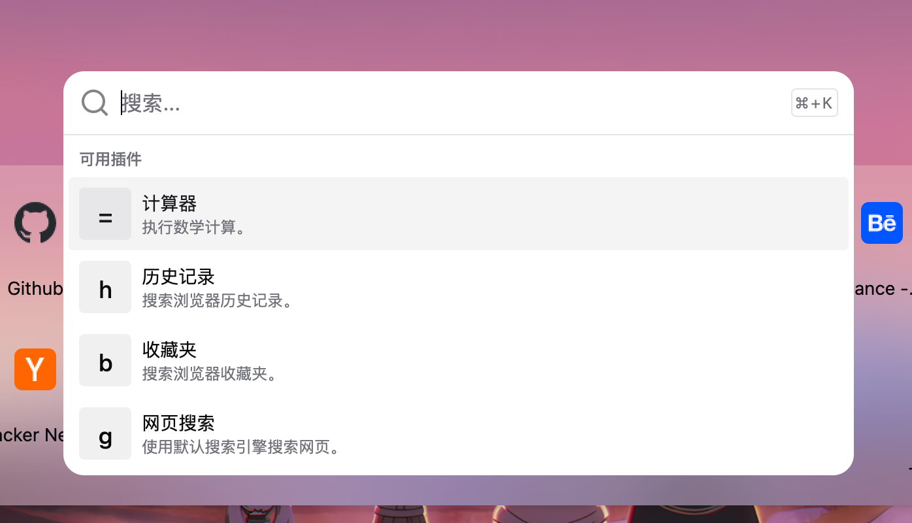
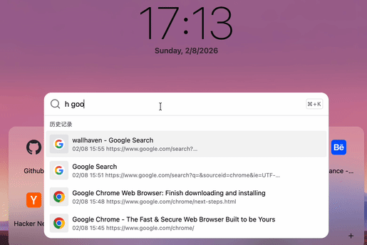
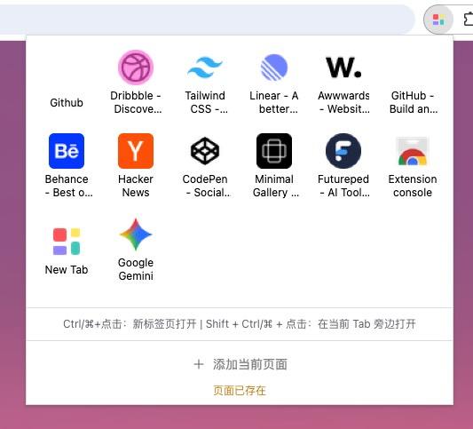

<div align="center">

<h1>NextTab</h1>
<p>一个聚焦效率的浏览器起始界面，简洁且现代</p>

[](https://react.dev/)
[](https://www.typescriptlang.org/)
[](https://vitejs.dev/)
[](https://github.com/N0I0C0K/NextTab/blob/main/LICENSE)
[](https://github.com/N0I0C0K/NextTab/releases)

[English](README.en.md) | 简体中文

</div>

---

## 📖 目录

- [简介](#简介)
- [核心特性](#-核心特性)
- [功能展示](#-功能展示)
  - [快捷链接](#快捷链接)
  - [命令面板](#命令面板)
- [安装](#安装)
- [开发](#开发)
- [浏览器支持](#浏览器支持)
- [开源协议](#开源协议)

## 简介

NextTab 是一个专注于提升浏览器效率的新标签页扩展，采用简洁现代的设计风格。让你更快地找到并访问目标网站，专注于真正重要的事情。


## ✨ 核心特性

- 🔗 **高效快捷链接** - 快速访问常用网站，支持拖拽排序。右键菜单提供多种快捷指令
- 🎨 **个性化背景** - 自定义壁纸，默认集成 [Wallhaven](https://wallhaven.cc/) 高质量壁纸
- ⚡ **强大的命令面板** - 快速搜索标签页、书签、历史记录等（持续开发中）
- ⌨️ **键盘优先** - 完善的键盘快捷键支持，操作更高效
- 📱 **响应式设计** - 适配各种屏幕尺寸，提供一致体验
- 🔒 **隐私至上** - 本地运行，不收集用户数据
- 🌐 **跨设备同步** - 通过 MQTT 协议在多设备间同步数据（可选）

## 📸 功能展示

### 快捷链接

一键访问常用网站，通过拖拽轻松调整顺序：



#### 智能右键菜单

右键点击快捷链接，快速访问相关的标签页、书签和历史记录：



#### 快速查看访问历史

右键菜单中可以快速查看该域名下的最近访问记录，轻松回到之前浏览的页面：



### 命令面板

使用快捷键 `Cmd/Ctrl + K` 唤起命令面板，快速搜索和执行操作：



**历史搜索功能**



### Popup 界面


- 无需到 New Tab 页面也能快速访问快捷链接
- 一键添加当前页面到快捷链接


## 安装

### 从商店安装

[Chrome Web Store](https://chromewebstore.google.com/detail/nbeegkbcmmchnnncomjhhmljncmcclfd?utm_source=item-share-cb)

<!-- - [Firefox Add-ons](#) -->

### 手动安装（开发版）

请参考 [开发指南](DEVELOPMENT.md#快速开始) 了解如何从源码构建和安装。

## 开发

如果你想参与开发或自定义扩展，请查看 [开发指南](DEVELOPMENT.md)。

开发指南包含：
- 环境搭建
- 项目结构详解
- 开发工作流
- 代码规范
- 构建和测试

### 快速开始

```bash
# 克隆项目
git clone https://github.com/N0I0C0K/NextTab.git
cd NextTab

# 安装依赖
pnpm install

# 启动开发模式
pnpm dev
```

更多详细信息，请参考 [DEVELOPMENT.md](DEVELOPMENT.md)。

## 浏览器支持

- ✅ Chrome/Edge (推荐)
- ✅ Firefox
- ⚠️ 其他基于 Chromium 的浏览器（未测试）

## 开源协议

本项目采用 [MIT License](LICENSE) 开源协议。

---

<div align="center">
  
**如果觉得有帮助，请给个 ⭐️ Star！**

Made with ❤️ by [N0I0C0K](https://github.com/N0I0C0K). Powered by [chrome-extension-boilerplate-react-vite](https://github.com/Jonghakseo/chrome-extension-boilerplate-react-vite)

</div>

