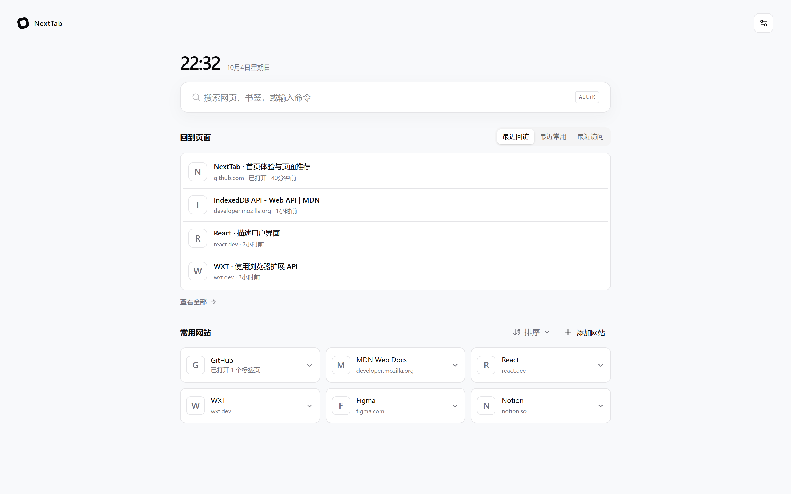
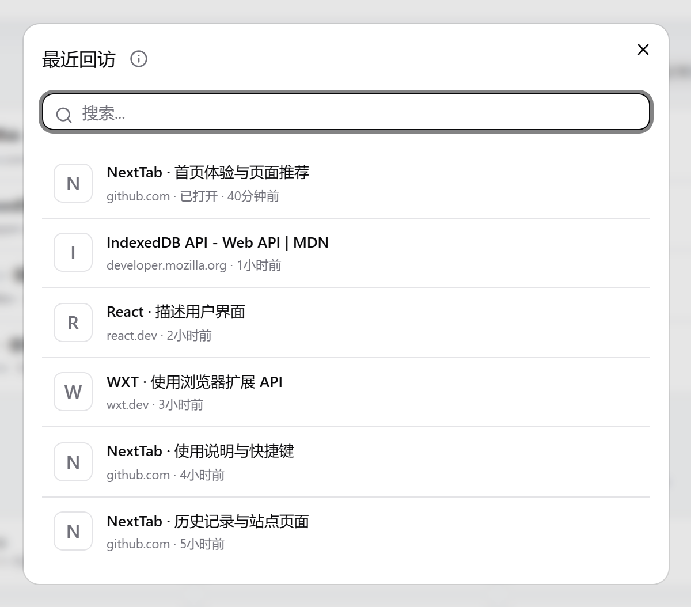
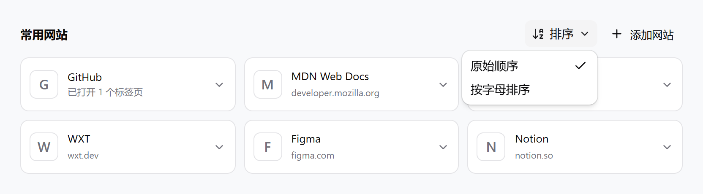
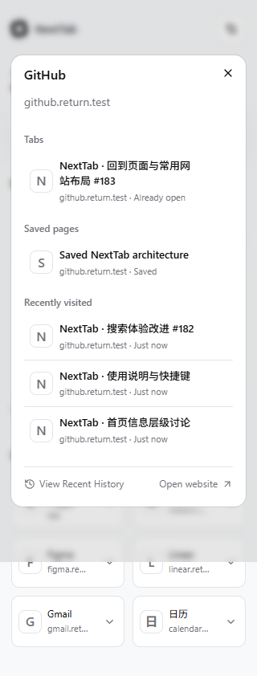
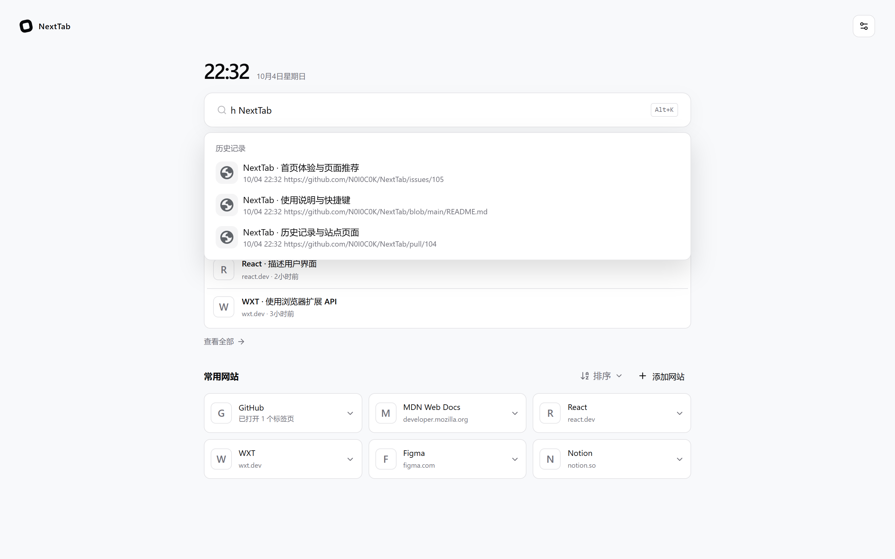
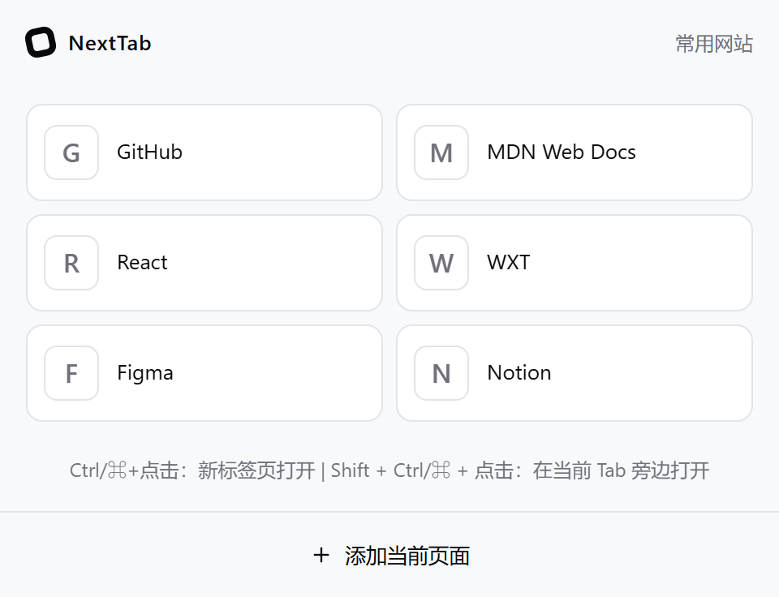

<div align="center">

<h1>NextTab</h1>
<p>一个聚焦效率的浏览器起始界面，简洁且现代</p>

[](https://react.dev/)
[](https://www.typescriptlang.org/)
[](https://wxt.dev/)
[](https://github.com/N0I0C0K/NextTab/blob/master/LICENSE)
[](https://github.com/N0I0C0K/NextTab/releases)

[English](README.en.md) | 简体中文

</div>

---

## 📖 目录

- [简介](#简介)
- [核心特性](#-核心特性)
- [功能展示](#-功能展示)
  - [回到页面](#回到页面)
  - [快捷链接](#快捷链接)
  - [命令面板](#命令面板)
  - [Popup 界面](#popup-界面)
  - [主题与数据管理](#主题与数据管理)
- [安装](#安装)
- [开发](#开发)
- [浏览器支持](#浏览器支持)
- [开源协议](#开源协议)

## 简介

NextTab 是一个专注于提升浏览器效率的新标签页扩展，采用简洁现代的设计风格。把可能想回访的页面、常用网站和搜索放在一起，让你更快地找回浏览进度，专注于真正重要的事情。



## ✨ 核心特性

- 🕘 **回到页面** - 根据本地使用记录推荐可能想回访的页面，也可以查看最近常用和最近访问的页面
- 🔗 **高效快捷链接** - 快速访问常用网站，支持拖拽和按字母排序。展开站点即可查看相关页面
- ⚡ **强大的命令面板** - 快速搜索标签页、书签、历史记录，支持网页搜索、计算器和人民币大写转换
- 🎨 **简洁明暗主题** - 支持浅色、深色和跟随系统，让页面保持清晰舒适
- ⌨️ **键盘优先** - 完善的键盘快捷键支持，操作更高效
- 📱 **响应式设计** - 适配各种屏幕尺寸，提供一致体验
- 🔒 **隐私至上** - 核心功能在本地运行，页面使用记录和推荐偏好保存在当前浏览器中，不收集用户数据
- 💾 **数据备份** - 导出和导入快捷链接、设置，方便备份或迁移
- 🌐 **跨设备同步** - 通过 MQTT 协议在多设备间同步数据（可选 & WIP）

## 📸 功能展示

### 回到页面

打开新标签页，快速回到之前浏览的内容：

- **最近回访** - 根据最近 7 天的页面使用情况，推荐你可能想继续浏览的页面
- **最近常用** - 查看最近 30 天访问过的页面，按访问天数排序
- **最近访问** - 按本地记录中最近进入页面的时间倒序展示

点击页面即可打开，已打开的页面可以直接切换到对应标签页；有多个匹配标签页时，可以选择要返回的标签页。通过「查看全部」展开完整列表，还可以按标题或网址搜索：



页面菜单提供查看详情、复制链接等操作。在推荐列表中，还可以隐藏某个页面或不再推荐某个网站，并通过提示撤销。

### 快捷链接

一键访问常用网站，通过拖拽轻松调整顺序，也可以切换到按字母排序。切回「原始顺序」即可恢复之前的排列：



#### 展开站点页面

点击快捷链接右侧的展开按钮，集中查看该网站已打开的标签页、保存的页面和最近访问记录。无需在多个窗口和书签中来回翻找：



通过底部的「查看最近历史记录」，还可以搜索该网站的更多访问记录。

#### 智能右键菜单

右键点击快捷链接，可以编辑或删除网站、查看最近历史记录，也能快速访问推荐页面、相关书签和已打开的标签页。

### 命令面板

点击首页搜索框，或使用快捷键 `Alt + K`（Windows） / `⌘ + K`（macOS）聚焦命令面板，快速搜索和执行操作：



直接输入关键词，可以搜索已打开的标签页、书签和历史记录。也可以使用默认指令缩小范围：

| 指令示例      | 功能                           |
| ------------- | ------------------------------ |
| `h NextTab`   | 搜索历史记录                   |
| `b NextTab`   | 搜索书签                       |
| `g NextTab`   | 使用浏览器默认搜索引擎搜索网页 |
| `= 12 * 8`    | 计算表达式，选中结果即可复制   |
| `rmb 1234.56` | 将金额转换为人民币大写         |

输入框为空时会显示可用指令。在设置中可以调整指令开关、触发词和是否参与全局搜索。

### Popup 界面



- 无需到 New Tab 页面也能快速访问快捷链接
- 一键添加当前页面到快捷链接
- 与新标签页共用快捷链接和排序设置

### 主题与数据管理

- **明暗主题** - 在外观设置中选择浅色、深色或跟随系统
- **首页设置** - 按需显示「回到页面」、相关书签和已打开的标签页，调整搜索框聚焦行为
- **数据备份** - 在数据设置中导出或导入 JSON 文件，备份快捷链接和设置
- **多语言支持** - 提供简体中文、繁体中文、英文和德文界面

## 安装

### 从商店安装

[Chrome Web Store](https://chromewebstore.google.com/detail/nbeegkbcmmchnnncomjhhmljncmcclfd?utm_source=item-share-cb)

<!-- - [Firefox Add-ons](#) -->

### 手动安装（开发版）

请参考 [开发指南](DEVELOPMENT.md#环境与启动) 了解如何从源码构建和安装。

## 开发

如果你想参与开发或自定义扩展，请查看 [开发指南](DEVELOPMENT.md)。

开发指南包含：

- 环境要求与启动
- 项目结构
- 常用开发命令
- 本地存储
- 构建、测试与发布

### 快速开始

需要 Node.js 20.19+ 和 pnpm 9.9。

```bash
# 克隆项目
git clone https://github.com/N0I0C0K/NextTab.git
cd NextTab

# 安装依赖
pnpm install

# 启动开发模式
pnpm dev
```

更多详细信息，请参考 [DEVELOPMENT.md](DEVELOPMENT.md)。

## 浏览器支持

- ✅ Chrome/Edge (推荐)
- ✅ Firefox
- ⚠️ 其他基于 Chromium 的浏览器（未测试）

## 开源协议

本项目采用 [MIT License](LICENSE) 开源协议。

---

<div align="center">

**如果觉得有帮助，请给个 ⭐️ Star！**

Made with ❤️ by [N0I0C0K](https://github.com/N0I0C0K). Powered by [WXT](https://wxt.dev/)

</div>
